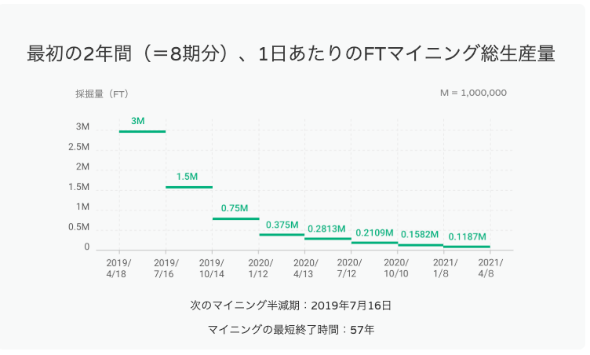
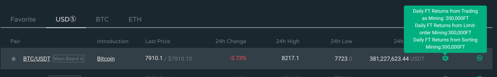

[トップページへ](./)

```
本ページはまだまだ工事中です。継続的に加筆修正していきます。
```

# マイニング詳解

マイニングについて詳細を知りたい人向けのページです。

<div style="text-align: right;">
    <a href="https://www.fcoin.com/mining" target="_brank">FCoinのマイニング説明ページへ（英語）</a>  
</div>  

## マイニングとは

FCoinプラットフォームを利用すると、１年ロックアップされた状態のFTが付与されます。  
これをマイニングと呼んでいます。  
通常の取引だけでもマイニングになりますが、他にも色々な方法でFTをマイニングすることができます。  


## 半減期について

マイニングには、四半期ごとに半減期が存在し、徐々にマイニングの総生産量が下がっていきます。  
下記の図は、マイニングの半減期と各期間ごとの一日あたりのマイニング総生産量です。




## マイニングの種類

現時点では以下のようなマイニングの種類があります。

- [取引マイニング (Trade mining, Trading as mining)](#取引マイニング-trade-mining-trading-as-mining)
- [未約定注文マイニング (Limit-order mining)](#未約定注文マイニング-limit-order-mining)
- [直近板並べマイニング (Sorting minig)](#直近板並べマイニング-sorting-minig)
- [レバレッジマイニング (Lending as mining, Leverage mining)](#レバレッジマイニング-lending-as-mining-leverage-mining)
- [理財マイニング (Financial mining)](#理財マイニング-financial-mining)
- [FTロックアップマイニング (Lockup mining)](#ftロックアップマイニング-lockup-mining)
- [投票マイニング (Mining currencies voting)](#投票マイニング-mining-currencies-voting)
- [PRマイニング (Promotion mining, PR mining)](#prマイニング-promotion-mining-pr-mining)

---

### 取引マイニング (Trade mining, Trading as mining)

| 項目             | 説明                   | 
|:-----------------|:-----------------------|
| 参加方法          | 特定の通貨ペアでの取引成立 |
| 参加条件          | 全員参加可能*1 |
| FTの付与タイミング | 取引発生の翌日中（日本時間の深夜1:00締め） |

    
#### 解説
特定の通貨ペアで取引が成立すると、出来高への貢献度に応じて、翌日マイニング報酬のFTが付与されます。  
一日あたりのマイニング総生産量が通貨ペアごとに決まっており、定期的に生産量の見直しがされます。  
基本的には各通貨ペアごとの出来高に対し、自身が当該通貨ペアで貢献した出来高の割合が、付与されるFTの量となります。  
マイニングできるFTの目安は下記の計算式によって見積もることが可能です*1。

```
翌日付与されるFT ≒ 当該通貨ペアの一日のFT総生産量 ✕ (当該通貨ペアで自身が貢献した出来高 / 当該通貨ペアの出来高)
```
*1 KYC済みで、かつ、50回以内の注文回数（注文キャンセル分も含む）の場合（後述）

取引マイニングには全員が参加可能ですが、KYCが済んでいて、かつ、一日の注文が50回以内の場合にマイニングの効率が最大となります。  
逆に、KYCしていない場合、もしくは、1日あたり50回の注文（キャンセル含む）を超えた場合、上記の式ほどの効率が出せません。  
この場合、短時間で多くの出来高をあげるよりも24時間バランスよく安定して出来高をあげた方が評価が高くなるため、
Botでマイニングに参加される方はできるだけ長時間安定して取引させるようにすると効率が良くなります。


*FCoin KOUさんより提供

#### 取引マイニング対応通貨
取引マイニングの対応通貨ペアは下記のアイコンが表示されています。  
また、アイコンへカーソルを合わせると現在の一日あたりのマイニング生産量が表示されます。





---

### 未約定注文マイニング (Limit-order mining)

| 項目             | 説明                   | 
|:-----------------|:-----------------------|
| 参加方法          | 特定の通貨ペアで注文を出す |
| 参加条件          | 全員参加可能 |
| FTの付与タイミング | 翌日中（日本時間の深夜1:00締め） |
    
#### 解説
指値注文をしておくと、FTをマイニングすることができます。  
現在価格に近いほどマイニングの効率が高くなります。

---

### 直近板並べマイニング (Sorting minig)

| 項目             | 説明                   | 
|:-----------------|:-----------------------|
| 参加方法          | 特定の通貨ペアで注文板の上下15個以内に注文を出す |
| 参加条件          | 全員参加可能 |
| FTの付与タイミング | 翌日中（日本時間の深夜1:00締め） |
    
#### 解説
現在価格からみて前後15個までに注文を出すとFTをマイニングすることができます。


---

### レバレッジマイニング (Lending as mining, Leverage mining)

| 項目             | 説明                   | 
|:-----------------|:-----------------------|
| 参加方法          | レバレッジ取引のためのローンをしてから24時間以上経過 |
| 参加条件          | 全員参加可能 |
| FTの付与タイミング | 毎日（日本時間の深夜1:00締め） |
    
#### 解説
レバレッジ取引利用時のローンの利子に応じたFTが配布されます。
マイニング量は利息に対し最大150%相当の価値のFTとなり、このパーセンテージは定期的に見直しされます。


---

### 理財マイニング (Financial mining)

| 項目             | 説明                   | 
|:-----------------|:-----------------------|
| 参加方法          | 理財口座に預金し、利息発生時 |
| 参加条件          | 10000FT以上をロックアップ済みであること |
| FTの付与タイミング | 毎週火曜日（日本時間の朝9:00締め） |
    
#### 解説
理財に預金して得る利息に応じてFTが毎週火曜日に配布されます。  
理財マイニングの毎週の採掘量は決まっており、理財全体の利息に対する自分が得た利息の割合に応じてFTを山分けする形になります。


---

### FTロックアップマイニング (Lockup mining)

| 項目             | 説明                   | 
|:-----------------|:-----------------------|
| 参加方法          | FTをロックアップし、24時間以上が経過 |
| 参加条件          | 全員参加可能 |
| FTの付与タイミング | 毎日（日本時間の深夜1:00締め） |
    
#### 解説
FTをロックアップしておくと毎日の配当とは別にFTが配布されます。
ロックアップタイプによって、マイニングの効率が異なり、期間が長いほどマイニング効率が上がります。


---

### 投票マイニング (Mining currencies voting)

| 項目             | 説明                   | 
|:-----------------|:-----------------------|
| 参加方法          | 投票イベント時に投票すること |
| 参加条件          | 10000FT以上ロックアップ済み & KYC済みであること |
| FTの付与タイミング | 投票期間終了後、数日以内に配布 |
    
#### 解説
定期的に投票イベントがあり、それらへ投票をすると、一定数のFTがもらえます。  
また、トップ10の候補に投票していた場合、ボーナスとしてさらにFTが追加でもらえます。

---

### PRマイニング (Promotion mining, PR mining)

| 項目             | 説明                   | 
|:-----------------|:-----------------------|
| 参加方法          | PRマイニングに出馬し、一定の投票を得ること |
| 参加条件          | 10000FT以上ロックアップ済み & KYC済みであること |
| FTの付与タイミング | 投票期間終了から約一週間前後で配布 |
    
#### 解説
FCoinおよびFTのプロモーション成果をアピールする機会として2週間毎にPRマイニングがあります。
FCoinユーザー全体から認められ多くの得票を集めると、得票順位に応じたFTがもらえます。

---
[一番上へ](#top)