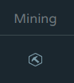
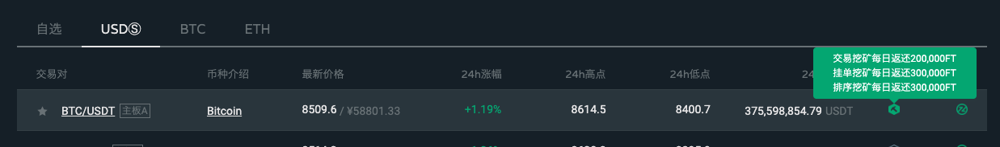
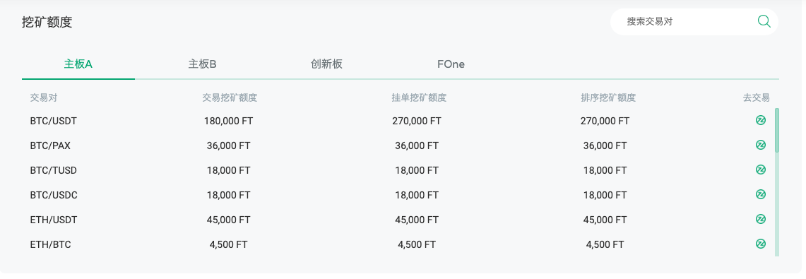
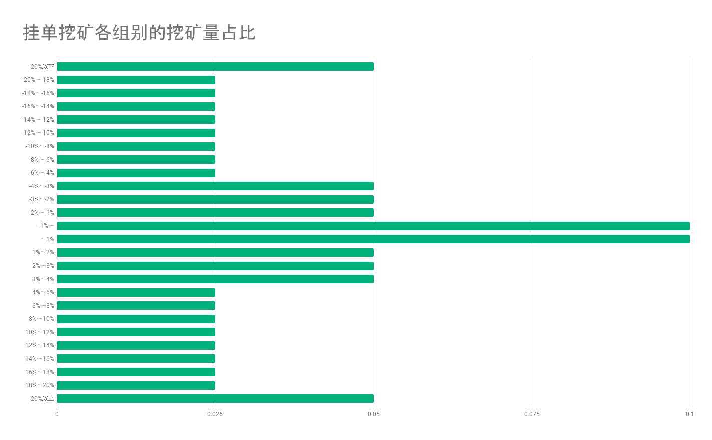
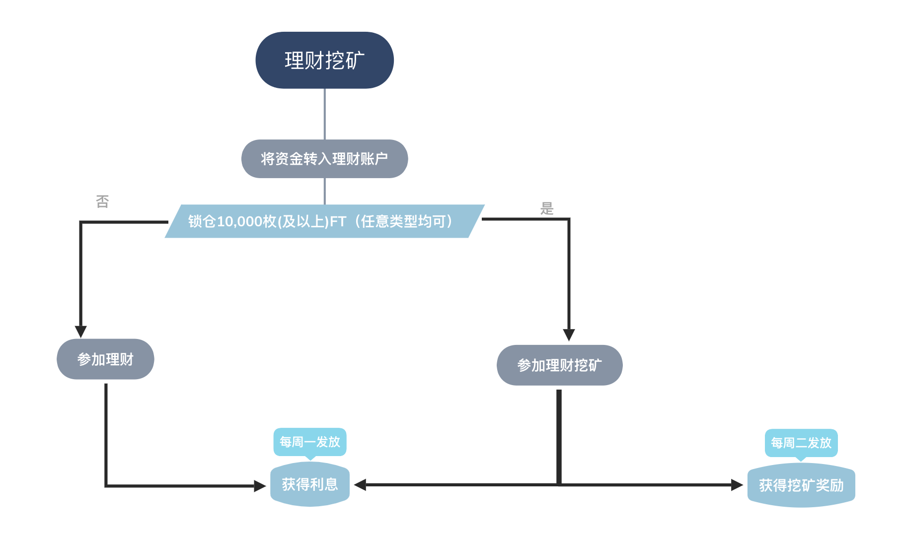
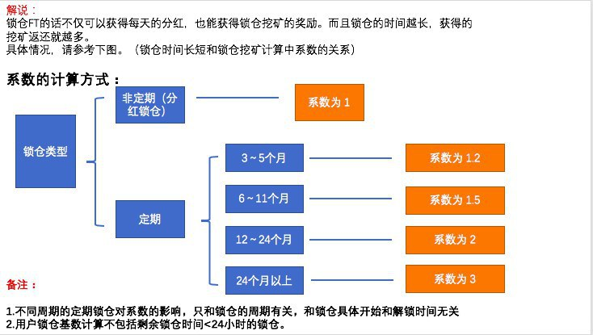
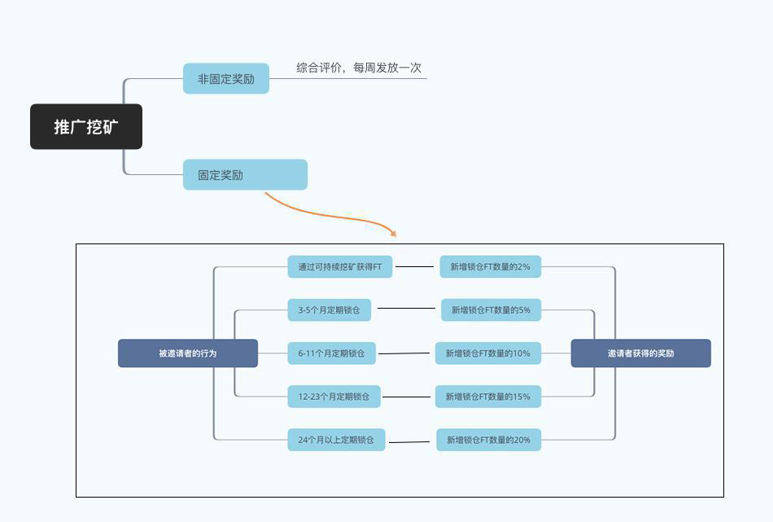
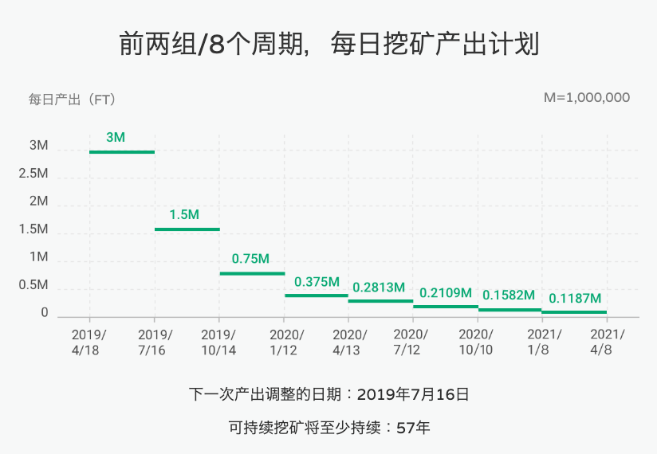
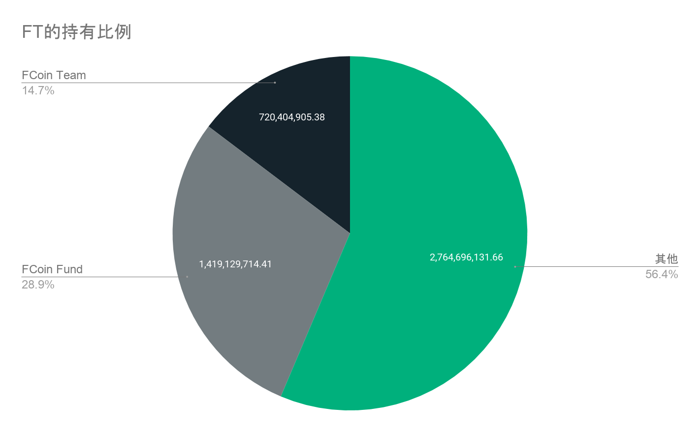

[前往首页](./)

## 目录

- [什么是挖矿](#什么是挖矿)
- [挖矿的种类](#挖矿的种类)
    - [交易挖矿 (Trade mining, Trading as mining)](#交易挖矿-trade-mining-trading-as-mining)
    - [挂单挖矿 (Limit-order mining, Place-order mining)](#挂单挖矿-limit-order-mining-place-order-mining)
    - [排序挖矿 (Sorting mining)](#排序挖矿-sorting-mining)
    - [杠杆交易 (Lending as mining, Leverage mining)](#杠杆挖矿-lending-as-mining-leverage-mining)
    - [理财挖矿 (Financial mining)](#理财挖矿-financial-mining)
    - [FT锁仓挖矿 (Lockup mining)](#ft锁仓挖矿-lockup-mining)
    - [投票挖矿 (Mining currencies voting)](#投票挖矿-mining-currencies-voting)
    - [推广挖矿 (Promotion mining, PR mining)](#推广挖矿-promotion-mining-pr-mining)
    - [邀请挖矿 (Inviting mining)](#邀请挖矿-inviting-mining)
- [关于减半机制](#关于减半机制)
- [挖矿中发放的FT是从哪里来的](#挖矿中发放的ft是从哪里来的)
- [挖矿的要点](#挖矿的要点)

# 什么是挖矿？

比特币的挖矿是指，通过电费和设备器材费用等花费而获得与之相应的比特币的过程。  
FT的挖矿与之思路相同，是指通过在FCoin平台付出劳动力，成本而获得与之相应的FT的过程。  
在FT的挖矿中付出的劳动力，成本指的是大量使用FCoin平台这件事。

普通的交易也可以参与挖矿，此外还有各种方法也可以参与FT挖矿。
如果参与挖矿，就可以获得锁仓1年的FT。  
  
<div style="text-align: right;">
    <a href="https://www.fcoin.com/mining" target="_brank">前往FCoin挖矿说明页面</a>  
</div>  

*锁仓是指、如同字面意思一般被固定无法移动的状态。  
虽然被锁仓的FT无法买卖及充值提现、但是基础的分红、投票等权益依旧有保障。

# 挖矿的种类

现阶段，有以下几种挖矿。

- [交易挖矿 (Trade mining, Trading as mining)](#交易挖矿-trade-mining-trading-as-mining)
- [挂单挖矿 (Limit-order mining, Place-order mining)](#挂单挖矿-limit-order-mining-place-order-mining)
- [排序挖矿 (Sorting mining)](#排序挖矿-sorting-mining)
- [杠杆挖矿 (Lending as mining, Leverage mining)](#杠杆挖矿-lending-as-mining-leverage-mining)
- [理财挖矿 (Financial mining)](#理财挖矿-financial-mining)
- [FT锁仓挖矿 (Lockup mining)](#ft锁仓挖矿-lockup-mining)
- [投票挖矿 (Mining currencies voting)](#投票挖矿-mining-currencies-voting)
- [推广挖矿 (Promotion mining, PR mining)](#推广挖矿-promotion-mining-pr-mining)
- [邀请挖矿 (Inviting mining)](#邀请挖矿-inviting-mining)

---

## 交易挖矿 (Trade mining, Trading as mining)

| 项目             | 说明                   | 
|:-----------------|:-----------------------|
| 参加方法          | 在指定交易对成交 |
| 参加条件          | 全员可以参加 |
| FT的发放时间 | 交易成交次日（GMT+8） |

    
### 解说
在指定交易对成交，根据对交易额的贡献程度，次日会发放挖矿返还部分的FT。
交易对不同，当日的挖矿额度不同，而且定期会调整挖矿额度。
根据用户所贡献的交易额占各个交易对的交易额的比重，计算最终所发放的FT挖矿返还的数量。
挖矿所能获得的FT返还，大抵可以通过下列公式进行计算（分为两部分）。

- 按照一整天中对于交易总额的贡献程度
```
次日发放的FT = 该交易对每日挖矿额度 ✕50% ✕(用户在该交易对贡献的交易量 / 该交易对交易总量)
```

- 按照每一分钟对于这一分钟内交易额的贡献程度
```
次日发放的FT = 该交易对每日挖矿额度 ✕1/2880 ✕(用户在一分钟内对该交易对贡献的交易量 / 该交易对一分钟内的交易总量)
```

### 挖矿对应币种
交易挖矿，挂单挖矿，排序挖矿对应的支持币种如下：   
此外，将光标移动到对应图标时，将分别显示当前的每日挖矿生产量。




  
需要注意的是，仅仅显示了挖掘图标，并不代表都支持交易挖矿，挂单挖矿，排序挖矿，
请务必仔细查看显示的内容。
英语和中文的对应关系如下：
- Trading as Mining = 交易挖矿
- Limit-order Mining = 挂单挖矿
- Sorting Mining = 排序挖矿

此外，可以在FCoin官网[挖矿详解页面](https://www.fcoin.com/mining)的"Mining Amount"内容上进行全部确认。  
请看下图（图像时间为2019年5月。最新的挖矿量请参考链接）。



---

## 挂单挖矿 (Limit-order mining, Place-order mining)

| 項目             | 说明                   | 
|:-----------------|:-----------------------|
| 参加方法          | 针对特定交易对下单 |
| 参加条件          | 全员可以参加 |
| FT发放时间 | 次日内 |
    
### 解说
可以通过对特定货币进行挂单进行挖矿FT。
对于每种交易对，挂单挖矿下每日挖矿总生产量是固定的，
但会不定期调整。
越接近盘口价格，挖矿效率越高，每5分钟进行一次随机快照，
根据当时的价格和挂单状态对挂单进行分组，每个组内分配一定数量的FT。
下图显示了当FT的总挖矿量为1时，各组所占的比率。 


*在最新价格价差20％以外的挂单效率是最差的。

需要注意的是，排序挖矿将在24:00重置(GMT+8)。
要继续参与挖矿的话，需要每天24:00重新挂单(GMT+8)。

### 挖矿支持的交易对
与交易挖矿一样的挖矿图标，也可以在FCoin官方挖矿页面上查看。
详情请参考交易挖矿的[挖矿对应币种]（＃挖矿对应币种）。

---

## 排序挖矿 (Sorting mining)

| 项目             | 说明                   | 
|:-----------------|:-----------------------|
| 参加方法          | 针对特定交易对下单，且下单价格在买卖盘上下15档以内 |
| 参加条件          | 全员都可以参加 |
| FT发放时间 | 次日内 |
    
### 解説
盘口上下15档价格内为排序挖矿参与对象。

FCoin电报公告频道的note版本里有详细的解说。
<a href="https://note.mu/fcoinfanjapanese/n/ne59cd48cc711" target="_brank">【帮助中心】关于排序挖矿的说明 | note | FCoin电报公告频道</a>

### 挖矿对应币种
与交易挖矿一样的挖矿图标，也可以在FCoin官方挖矿页面上查看。  
有关详细信息，请参考交易挖矿的[挖矿对应币种]（＃挖矿对应币种）.

---

## 杠杆挖矿 (Lending as mining, Leverage mining)

| 项目             | 说明                   | 
|:-----------------|:-----------------------|
| 参加方法          | 杠杆借贷时长须超过24小时 |
| 参加条件          | 全员都可以参加 |
| FT发放时间 | 次日内 |
    
### 解说
根据杠杆借贷产生的利息来返还相应的FT.
杠杆借贷按日计息，FCoin将于当日计息产生后，将当日计息金额按FT当日均价150%(视情况进行调整）折合成FT，并于次日完成返还。

作为返还比率的调整依据，由于杠杆的借贷源自于理财账户中的资产，
会通过调整杠杆挖矿的返还比例，使理财存币规模和杠杆可以借贷金额之间尽可能取得平衡。  

- 理财存币规模相对于杠杆借贷需求较大时， 
  →提高杠杆挖矿的效率，降低理财挖矿的效率
- 杠杆借贷需求扩大，理财存币规模相对不足时，  
  →降低杠杆挖矿的效率，增加理财挖矿的效率
  
此外，杠杆借贷利息和理财存币利息的变动，也是基于同样的方法予以调整。

---

## 理财挖矿 (Financial mining)

| 项目             | 说明                   | 
|:-----------------|:-----------------------|
| 参加方法          | 在理财账户存币，产生利息 |
| 参加条件          | 锁仓10,000FT以上 |
| FT发放时间 | 每周周二 |
    
### 解说
根据在理财存入资产所获的的利息，每周二发放FT挖矿奖励。  
理财挖矿每周的产出既定，根据自己所获得的利息占利息总额的比例，分配FT 。

  
*FCoin Kou提供

每日理财挖矿产出的是固定的。会定期进行调整。
关于当前每日理财挖矿产出，
请在FCoin官网的[挖矿详解页面](https://www.fcoin.com/mining)的"理财挖矿"的条目进行确认。

---

## FT锁仓挖矿 (Lockup mining)

| 项目             | 说明                   | 
|:-----------------|:-----------------------|
| 参加方法          | 锁仓FT，并经过24小时以上 |
| 参加条件          | 全员都可以参加 |
| FT发放时间 | 每日 |
    
### 解说
活期锁仓（以前的分红锁仓）形式以外的锁仓类型（定期锁仓，社区推荐者，OTC商家，保荐机构）都能参加锁仓挖矿。
按照以上类型进行锁仓FT的话，就会获得每日分红收益和锁仓挖矿返还（分别发放）。
锁仓类型不同，挖矿的效率也不同。但是总体上为，锁仓的时间越长，挖矿效率就越高，获得的FT返还就越多。
具体，各个锁仓时间和效率（挖矿系数）的对应关系如下图。

  
*图片提供：<a href="https://note.mu/ilovebanana/n/n1789f51e1a4d" target="_brank">图解FCoin锁仓挖矿的算法升级 | note | 香蕉先生</a>

每天锁仓挖矿所产出的FT的总量也是固定的，会定期进行调整。
关于当前每日锁仓挖矿产出，
请在FCoin官网的[挖矿详解页面](https://www.fcoin.com/mining)的"锁仓挖矿"的条目进行确认。

---

## 投票挖矿 (Mining currencies voting)

| 项目             | 说明                   | 
|:-----------------|:-----------------------|
| 参加方法          | 举行参与投票挖矿的投票活动时，可参与投票 |
| 参加条件          | 锁仓10,000FT以上，且完成KYC认证 |
| FT发放时间 | 投票期间结束后数日内 |
    
### 解说
定期会举行投票活动，参与其中，即有机会获得一定数量的FT。  
此外，投中前十位作品的情况下，可以获得额外的FT。  
FT的发放数量会在投票活动时发布。
需要注意的是，不是所有的投票活动都是投票挖矿的对象，比如关系到FCoin平台重大机制改革的投票就不是投票挖矿的范围，而且不需要KYC.

---

## 推广挖矿 (Promotion mining, PR mining)

| 项目             | 说明                   | 
|:-----------------|:-----------------------|
| 参加方法          | 参与推广挖矿，获得一定投票 |
| 参加条件          | 定期锁仓10,000以上FT12个月，并且完成KYC认证 |
| FT发放时间 | 投票期间结束后约一周左右发放 |
    
### 解说
作为展示FCoin及FT相关的推广成果的机会，每个月会有一次推广挖矿活动。
满足参与推广挖矿的用户必须组成一个5人小组进行推广挖矿的申请，这个小组就是推广节点。
按照获得的参与投票的FCoin用户的票数多少进行排序，并获得相应奖励。

---

## 邀请挖矿 (Inviting mining)

| 项目             | 说明                   | 
|:-----------------|:-----------------------|
| 参加方法          | 通过邀请码邀请新用户，并且使其完成KYC认证 |
| 参加条件          | 完成KYC认证 |
| FT的发放时间  | 不同邀请奖励类型发放时间不同，基本为次日开始一周内 |
    
### 解说
通过邀请码邀请新用户，并且使其完成KYC认证的话，
即有机会获得邀请挖矿奖励。 
邀请挖矿奖励的获得根据被邀请者的相关行为进行计算，基本上可以这么认为，
被邀请者使用FCoin的次数越多，在FCoin交易的金额越多，锁仓FT的时间越长，邀请者获得的奖励就越多。



更多信息请参考以下链接。
<div style="text-align: right;">
    <a href="https://note.mu/fcoinfanjapanese/n/nfa2f06814420" target="_brank">邀请挖矿的说明 | note</a>  
</div>

此外，邀请码的查看页面为以下链接。
参加邀请挖矿的基本条件为，复制邀请链接（invitation link）发送给被邀请者，被邀请者必须通过邀请者发送的链接进行注册FCoin。
<div style="text-align: right;">
    <a href="https://www.fcoin.pro/invite" target="_brank">FCoin官网邀请码查看页面</a>  
</div>

---

# 关于减半机制

在挖矿中，每个周期（三个月）就会有一个半减期，以此来逐步减少挖矿的总产量。  
下图是挖矿半减期和各周期内每日的挖矿总产出。




# 挖矿中发放的FT是从哪里来的

并不是增发FT，而是来自叫做FCoin Fund的，
用于稳定FT市场的基金所持有的FT，因此，总发行数量并不会增加。  
更何况，由于现在的FCoin Fund所持有的FT获得的分红都会在每周五全部用于进行回购销毁，FT的总发行量实际上在逐步减少。
但是，根据现行的挖矿制度，会逐步派发FCoin Fund所持有的FT，因此FCoin Fund最终将会完全解体（最短也在57年后）。




*图像中的数据为截止2019年6月21日的FT持有数量。
 - [FCoin创业团队FT锁仓地址](https://etherscan.io/token/0xd37532d304214d588aeeac4c365e8f1d72e2304a?a=0xa51b6001e00879ca95a0f5e77e3e49469c920a7e)
 - [FCoin FundFT锁仓地址](https://etherscan.io/token/0xd37532d304214d588aeeac4c365e8f1d72e2304a?a=0xf6b64d970a9d6c2771bc79a34133d9f4b93990c0)

# 挖矿的要点

本页面解说了各种挖矿的种类，但是有一点非常重要，
**杠杆挖矿产出以外的FT产出量，都不依存于现阶段FT的价格。**  
此外，由于前面所提到的半减期的存在，所以越早参与挖矿越有利。  

---
[返回最上方](#top)
