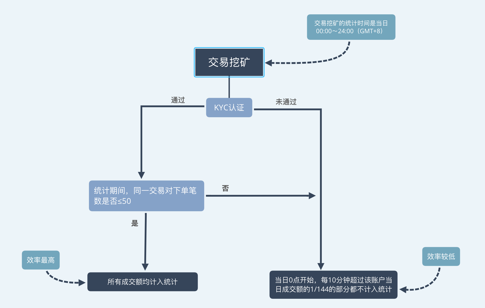

[トップページへ](./)

## 目次

- [挖矿とは](#挖矿とは)
- [挖矿の種類](#挖矿の種類)
    - [交易挖矿 (Trade mining, Trading as mining)](#交易挖矿-trade-mining-trading-as-mining)
    - [挂单挖矿 (Limit-order mining, Place-order mining)](#挂单挖矿-limit-order-mining-place-order-mining)
    - [排序挖矿 (Sorting mining)](#排序挖矿-sorting-mining)
    - [杠杆挖矿 (Lending as mining, Leverage mining)](#杠杆挖矿-lending-as-mining-leverage-mining)
    - [理财挖矿 (Financial mining)](#理财挖矿-financial-mining)
    - [FT锁仓挖矿 (Lockup mining)](#ft锁仓挖矿-lockup-mining)
    - [投票挖矿 (Mining currencies voting)](#投票挖矿-mining-currencies-voting)
    - [推广挖矿 (Promotion mining, PR mining)](#推广挖矿-promotion-mining-pr-mining)
- [半減期について](#半減期について)
- [挖矿で配られるFTはどこから来るのか](#挖矿で配られるftはどこから来るのか)
- [挖矿のポイント](#挖矿のポイント)

# 挖矿とは

ビットコインの挖矿では、電気代や設備機材のコストに対する対価としてビットコインが得られます。  
FTの挖矿も同様の考え方があり、FCoinプラットフォームでの労力やコストに対する対価としてFTを得ることができます。  
FT挖矿における労力やコストというのは、FCoinプラットフォームをたくさん利用するということです。

通常の取引自体も挖矿になりますが、他にも色々な方法でFTを挖矿することができます。
挖矿すると、1年ロックアップ*された状態のFTが付与されます。  
  
<div style="text-align: right;">
    <a href="https://www.fcoin.com/mining" target="_brank">FCoinの挖矿説明ページへ（日本語未対応）</a>  
</div>  

*ロックアップとは、その名の通り固定して動かせなくすることです。  
FTの売買や入出金はできませんが、配当や投票権などFTの基本的な権益は保証されます。

# 挖矿の種類

現時点では以下のような挖矿の種類があります。

- [交易挖矿 (Trade mining, Trading as mining)](#交易挖矿-trade-mining-trading-as-mining)
- [挂单挖矿 (Limit-order mining, Place-order mining)](#挂单挖矿-limit-order-mining-place-order-mining)
- [排序挖矿 (Sorting mining)](#排序挖矿-sorting-mining)
- [杠杆挖矿 (Lending as mining, Leverage mining)](#杠杆挖矿-lending-as-mining-leverage-mining)
- [理财挖矿 (Financial mining)](#理财挖矿-financial-mining)
- [FT锁仓挖矿 (Lockup mining)](#ft锁仓挖矿-lockup-mining)
- [投票挖矿 (Mining currencies voting)](#投票挖矿-mining-currencies-voting)
- [推广挖矿 (Promotion mining, PR mining)](#推广挖矿-promotion-mining-pr-mining)

---

## 交易挖矿 (Trade mining, Trading as mining)

| 項目             | 説明                   | 
|:-----------------|:-----------------------|
| 参加方法          | 特定の通貨ペアでの取引成立 |
| 参加条件          | 全員参加可能だがKYC済みの方が効率が良い場合あり |
| FTの付与タイミング | 取引発生の翌日中（日本時間の深夜1:00締め） |

    
### 解説
特定の通貨ペアで取引が成立すると、出来高への貢献度に応じて、翌日挖矿報酬のFTが付与されます。  
一日あたりの挖矿総生産量が通貨ペアごとに決まっており、定期的に生産量の見直しがされます。  
基本的には各通貨ペアごとの出来高に対し、自身が当該通貨ペアで貢献した出来高の割合が、付与されるFTの量となります。  
挖矿できるFTの目安は下記の計算式によって見積もることが可能です*1。

```
翌日付与されるFT ≒ 当該通貨ペアの一日のFT総生産量 ✕ (当該通貨ペアで自身が貢献した出来高 / 当該通貨ペアの出来高)
```
*1 KYC済みで、かつ、50回以内の注文回数（注文キャンセル分も含む）の場合（後述）

交易挖矿には全員が参加可能ですが、KYCが済んでいて、かつ、一日の注文が50回以内の場合に挖矿の効率が最大となります。  
逆に、KYCしていない場合、もしくは、1日あたり50回の注文（キャンセル含む）を超えた場合、上記の式ほどの効率が出せません。  
この場合、短時間で多くの出来高をあげるよりも24時間バランスよく安定して出来高をあげた方が評価が高くなるため、
Botで挖矿に参加される方はできるだけ長時間安定して取引させるようにすると効率が良くなります。


*FCoin KOUさんより提供

### 挖矿対応通貨
交易挖矿、挂单挖矿、排序挖矿に対応する通貨ペアは下記のアイコンが表示されています。  
さらに、アイコンへカーソルを合わせると現在の一日あたりの挖矿生産量がそれぞれ表示されます。  


注意点として、挖矿アイコンが表示されているからといって、交易挖矿、挂单挖矿、排序挖矿の
すべての挖矿に対応しているとは限らないため、必ず表示内容をよく見るようにしましょう。  
英語と中国語の対応関係は下記の通りです。
- Trading as Mining = 交易挖矿
- Limit-order Mining = 挂单挖矿
- Sorting Mining = 排序挖矿

また、FCoin公式の[挖矿詳細ページ](https://www.fcoin.com/mining)の"Mining Amount"の項目で一覧形式で確認することもできます。  
下記の箇所です（画像は2019年5月現在のものです。最新の挖矿量はリンクからご確認ください）。


---

## 挂单挖矿 (Limit-order mining, Place-order mining)

| 項目             | 説明                   | 
|:-----------------|:-----------------------|
| 参加方法          | 特定の通貨ペアで注文を出す |
| 参加条件          | 全員参加可能 |
| FTの付与タイミング | 翌日中（日本時間の深夜1:00締め） |
    
### 解説
特定の通貨ペアで指値注文をしておくと、FTを挖矿することができます。  
挂单挖矿によって配布される一日あたりの挖矿総生産量は通貨ペアごとに決まっており、
定期的に生産量の見直しがされます。
現在価格に近いほど挖矿の効率が高く、5分周期でランダムにスナップショットが取られ、
その時点の現在価格と注文状況によって注文がグループ分けされ、各グループ内で一定の挖矿量を山分けする形となります。  
下記の図は、FTの挖矿総量を1としたときの、グループ別の分配割合です。  


*20%より外側がその内側より効率がよく見えますが、20%以外のすべての注文を含むことになりそれらでFTを山分けすることになるため、基本的に効率は最も悪くなります。

注意点として、挂单挖矿は日本時間の深夜1時にポイントのリセットがかかるため、
挖矿し続けるには、毎日深夜1時に指値し直す必要があります。

### 挖矿対応通貨
交易挖矿と同様に挖矿アイコンが表示され、FCoin公式の挖矿ページでも確認できます。  
詳しくは、交易挖矿の[挖矿対応通貨](#挖矿対応通貨)をご確認ください。


---

## 排序挖矿 (Sorting mining)

| 項目             | 説明                   | 
|:-----------------|:-----------------------|
| 参加方法          | 特定の通貨ペアで注文板の上下15個以内に注文を出す |
| 参加条件          | 全員参加可能 |
| FTの付与タイミング | 翌日中（日本時間の深夜1:00締め） |
    
### 解説
現在価格からみて前後15個までに注文を出すとFTを挖矿することができます。

注意点として、排序挖矿は日本時間の深夜1時にポイントのリセットがかかるため、
挖矿し続けるには、毎日深夜1時に指値し直す必要があります。

FCoinお知らせチャンネルのnoteに詳しい解説があります。  
<a href="https://note.mu/fcoinfanjapanese/n/ne59cd48cc711" target="_brank">【ヘルプセンター】排序挖矿についての説明 | note | FCoin お知らせチャンネル</a>

### 挖矿対応通貨
交易挖矿と同様に挖矿アイコンが表示され、FCoin公式の挖矿ページでも確認できます。  
詳しくは、交易挖矿の[挖矿対応通貨](#挖矿対応通貨)をご確認ください。


---

## 杠杆挖矿 (Lending as mining, Leverage mining)

| 項目             | 説明                   | 
|:-----------------|:-----------------------|
| 参加方法          | レバレッジ取引のためのローンをしてから24時間以上経過 |
| 参加条件          | 全員参加可能 |
| FTの付与タイミング | 毎日（日本時間の深夜1:00締め） |
    
### 解説
レバレッジ取引利用時のローンの利子に応じたFTが配布されます。
挖矿量は利息に対し最大150%相当の価値のFTとなり、このパーセンテージは定期的に見直しされます。

パーセンテージ見直しの基準として、レバレッジのローン貸し出しは理財に預金された資産によって運用されるため、
理財預金とレバレッジ利用の金額ができるだけバランスがよくなるように調整されていきます。  

- 理財預金総額が、レバレッジ利用の需要より十分大きい場合  
  →杠杆挖矿の効率が上がり、理财挖矿の効率が減少
- レバレッジ利用の需要が拡大し、理財預金総額が不足傾向の場合  
  →杠杆挖矿の効率が下がり、理财挖矿の効率が増加
  
また、レバレッジローンの利子や理財の利息の変動も同様の考え方をベースに見直しと調整がされます。

---

## 理财挖矿 (Financial mining)

| 項目             | 説明                   | 
|:-----------------|:-----------------------|
| 参加方法          | 理財口座に預金し、利息発生時 |
| 参加条件          | 10000FT以上をロックアップ済みであること |
| FTの付与タイミング | 毎週火曜日（日本時間の朝9:00締め） |
    
### 解説
理財に預金して得る利息に応じてFTが毎週火曜日に配布されます。  
理财挖矿の毎週の採掘量は決まっており、理財全体の利息に対する自分が得た利息の割合に応じてFTを山分けする形になります。


*FCoin Kouさんより提供

理财挖矿によって配布される毎日のFTの総量は固定ですが、定期的に見直しがされるため、
現在の一日あたりの理财挖矿のFT総生産量は、
FCoin公式の[挖矿詳細ページ](https://www.fcoin.com/mining)の"Financial Mining"の項目で確認してください。

---

## FT锁仓挖矿 (Lockup mining)

| 項目             | 説明                   | 
|:-----------------|:-----------------------|
| 参加方法          | FTをロックアップし、24時間以上が経過 |
| 参加条件          | 全員参加可能 |
| FTの付与タイミング | 毎日（日本時間の深夜1:00締め） |
    
### 解説
FTをロックアップしておくと毎日の配当とは別にFTが配布されます。
ロックアップタイプによって、挖矿の効率が異なり、期間が長いほど挖矿効率が上がります。  
具体的には、通常のロックアップに比べ、下記の図で算出される係数倍の量のFTが貰えるようになります。

  
*画像提供元：<a href="https://note.mu/ilovebanana/n/n1789f51e1a4d" target="_brank">FCoin锁仓挖矿のアリゴリズムのアップデートの図解 | note | バナナさん</a>

锁仓挖矿によって配布される毎日のFTの総量は固定ですが、定期的に見直しがされるため、
現在の一日あたりの锁仓挖矿のFT総生産量は、
FCoin公式の[挖矿詳細ページ](https://www.fcoin.com/mining)の"Lockup Mining"の項目で確認してください。

---

## 投票挖矿 (Mining currencies voting)

| 項目             | 説明                   | 
|:-----------------|:-----------------------|
| 参加方法          | 投票イベント時に投票すること |
| 参加条件          | 10000FT以上ロックアップ済み & KYC済みであること |
| FTの付与タイミング | 投票期間終了後、数日以内に配布 |
    
### 解説
定期的に投票イベントがあり、それらへ投票をすると、一定数のFTがもらえます。  
また、トップ10の候補に投票していた場合、ボーナスとしてさらにFTが追加でもらえます。  
FTの総配布量は投票イベントの際に発表されます。

---

## 推广挖矿 (Promotion mining, PR mining)

| 項目             | 説明                   | 
|:-----------------|:-----------------------|
| 参加方法          | 推广挖矿に出馬し、一定の投票を得ること |
| 参加条件          | 10000FT以上ロックアップ済み & KYC済みであること |
| FTの付与タイミング | 投票期間終了から約一週間前後で配布 |
    
### 解説
FCoinおよびFTのプロモーション成果をアピールする機会として2週間毎に推广挖矿があります。
FCoinユーザー全体から認められ多くの得票を集めると、得票順位に応じたFTがもらえます。

---

# 半減期について

挖矿には、四半期ごとに半減期が存在し、徐々に挖矿の総生産量が下がっていきます。  
下記の図は、挖矿の半減期と各期間ごとの一日あたりの挖矿総生産量です。


# 挖矿で配られるFTはどこから来るのか

新規でFTが発行されるわけではなく、FCoinファンドという
FT市場の安定のために利用されるファンドが保有するFTを徐々に配っているため、総発行枚数自体は増えません。  
むしろ、現在FCoinファンドは、保有分のFTに対する配当を原資に毎週金曜日にFTの買い戻しバーンを行なっているため、FTの総発行枚数は徐々に減っていきます。
しかし、挖矿の仕組みによって、徐々にFCoinファンド保有分のFTを配っていくので、最終的にはFCoinファンドは完全解体されます（最短でも57年後）。


*FTの保有枚数は2019年4月末時点のデータを元としています。
 - [FCoin創業チームFTロックアップアドレス](https://etherscan.io/token/0xd37532d304214d588aeeac4c365e8f1d72e2304a?a=0xa51b6001e00879ca95a0f5e77e3e49469c920a7e)
 - [FCoinファンドFTロックアップアドレス](https://etherscan.io/token/0xd37532d304214d588aeeac4c365e8f1d72e2304a?a=0xf6b64d970a9d6c2771bc79a34133d9f4b93990c0)

# 挖矿のポイント

本ページでは各挖矿の種類を解説していますが、非常に重要なポイントとして
**杠杆挖矿以外のFT挖矿で掘れるFTの量は、すべてFTの現在価格には依存していません。**  
また、前述の通り半減期の存在もありますから、挖矿は早ければ早いほど特であることがわかります。  

---
[一番上へ](#top)