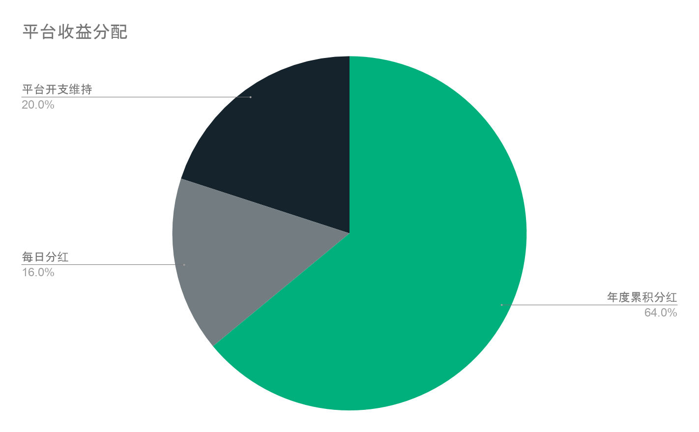
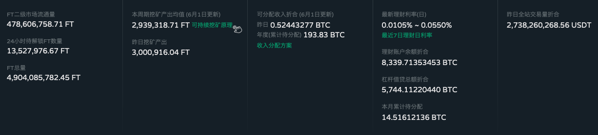

FT持有者所有、来自FT持有者、为了FT持有者的FCoin说明书*。  

    <small>*本说明书是基于MIT许可的开源软件。</small>

 

## 菜单

- [3分钟理解FCoin所提供的服务页面](./3minutes-fcoin.html)
- [挖矿详解](./about-mining.html)
- [常见问题](./faq.html)
- [链接合集](./link.html)

---

# FCoin是什么？

FCoin是来自中国的数字货币交易所。是原HoubiCTO张健创设的、
同时也具备中国最大的加密媒体火星财经持有1亿FT这样的话题性，
是最初发明/装载了现如今多数交易所采用的下列概念的先驱者：  
- 交易挖矿
- IEO
- 收益与资产透明化
- 将80%收入分红给平台币持有者

    <a href="https://www.fcoin.com" target="_brank">到FCoin官方网站</a>  

  

# FT是什么？

FT起初是FCoin的平台币，作为社区化交易平台FCoin的权益代表。  
随着Fractal项目的启动，FCoin Token正式升级为FToken，其本身也从“平台币”升级为“公链币”。

| 项目         | 说明          |
|:-------------|:------------------|
| 币种名称          | FToken |
| 币种代称 | FT   |
| 总发行量           | `4,904,165,442.45 FT`  *截至2019/5/17点*      |
| 白皮书           | <a href="https://fractalproject.com/assets/pdf/fractal-whitepaper.pdf" target="_brank">项目白皮书</a> <a href="https://fractalproject.com/assets/pdf/fractal-technical-whitepaper.pdf" target="_brank">技术白皮书</a> |
| 区块链浏览器 | <a href="https://m.ft.im/" target="_brank">https://m.ft.im/</a> |

*[挖矿详解](./about-mining.html#マイニングで配られるftはどこから来るのか)也有所提及，  
FCoin Fund每周五会将本周分红用于回购销毁，
由于FCoin Fund的存在，FT是一种总发行量在逐渐减少的通缩型数字资产。

## 持有FT的好处

- 通过锁仓可以获得每日分红
- 通过持有，可以在每年1月1日获得年度分红
- 通过锁仓可以获得参与各种选举的投票权
- 参与FCoin提供的一部分服务需要锁仓一定量的FT

## 分红制度

取通过用户在交易所交易，FCoin平台可以获得手续费收益。  
其中20%用于支持平台基本开支，80%将分配给FT持有者。  
每日平台收益的使用途径如下图所示。  

补充说明:  
由图可见，维系平台运营的费用仅占据20%，由此，常被问及以这样极少的费用维系平台运转是否很困难？  
这些只不过是用在维持平台和广告宣传等上面的预算。  
实际上，平台自己掌握了FT总发行量的14%以上，这部分当然也是有分红的，这部分也是可以成为收益来源。

# 进一步了解FCoin

## 手续费制度

maker方负手续费、taker方支付手续费。
其中结余部分会成为平台的收益。

  
FCoin官方的手续费表请前往[这里](https://fcoin.zendesk.com/hc/zh-cn/articles/360003715514)

## FCoin的收支数据
FCoin在FCoin官网首页公开展示与收益性相关的重要信息。 

此外，每日分红会被上传至<a href="https://fcoin.zendesk.com/hc/zh-cn/sections/360001156334-Income-distribution-details" target="_brank">这里</a>。  

# 关于挖矿

通过在交易所交易，获得交易所平台币，
作为创造了这样的“交易挖矿”概念进而广为人知的交易所FCoin，
现在将之改良、设计成了“日常使用FCoin就是参与FT的挖矿”。

- FCoin使用说明书中挖矿相关的说明页面请前往[这里](./about-mining.html)
- 官方挖矿相关说明页面请前往[这里](https://www.fcoin.com/mining) 