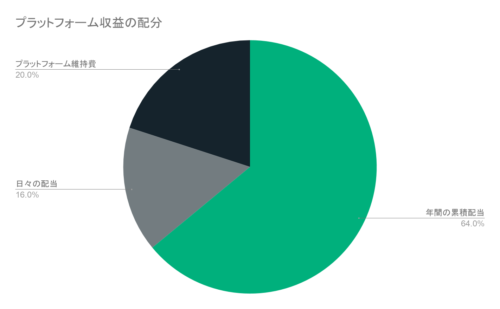

```
2019/4/25に作ったばかりです。まだまだ工事中なのであしからず。
```

# FCoin日本語トリセツ

FTホルダーのFTホルダーによるFTホルダーのための日本語トリセツです。

## メニュー

- [3分でFCoinのサービスを理解するページ](./3minutes-fcoin.html)
- [よくある質問【工事中】](./faq.html)
- [リンク集](./link.html)

---

# FTとは

FCoin取引所の取引所トークンです。  
今後6月のアップデートで独自チェーン（Fractalチェーン）に移行する予定です。

## FTを保有することによるメリット

- ロックアップすることで毎日配当がもらえる
- 保有しておくことで毎年1月1日にまとまった年間配当がもらえる
- ロックアップすることで各種選挙での投票権が付与される
- 一部サービスの参加条件としてFTのロックアップが必要

## 配当の仕組み

取引所でユーザーが取引することによって、FCoinプラットフォームは
手数料収益を得ます。  
このうち20%をプラットフォームの維持に使われ、80%がFTホルダーに分配される仕組みです。  
日々のプラットフォーム収益の使い道は下記のようになっています。



補足:  
図で見ると、プラットフォーム維持費がたったの20%しかなく、
プラットフォームを維持するのが難しいのではないかという意見をよく聞きます。  
これはあくまで、プラットフォームの維持や広告宣伝等にのみ使われる予算です。  
実際には、プラットフォーム自体もFT総発行枚数のうちの14%以上を握っており、
それらへも当然配当があるため、この部分も収益となります。  


    
