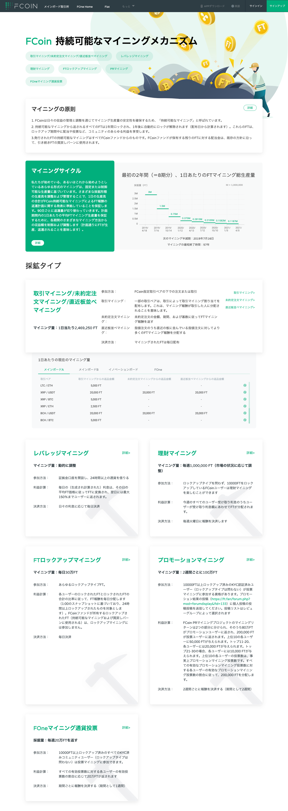

FTホルダーのFTホルダーによるFTホルダーのためのFCoin日本語トリセツです。  
本トリセツはMITライセンスによるオープンソースソフトウェアです。

## メニュー

- [3分でFCoinのサービスを理解するページ](./3minutes-fcoin.html)
- [マイニング詳解](./about-mining.md)
- [よくある質問](./faq.html)
- [リンク集](./link.html)
- 【準備中】 FCoin頻出英語集

---

# FCoinとは

中華系の仮想通貨取引所*。元HoubiのCTO張健が創設したということや、
中華クリプトメディアの最大手である火星財経が1億FTを保有するなど話題性もありますが
現在では多くの取引所が採用する下記の概念を最初に取り入れたパイオニアでもあります。

- 取引マイニング
- IEO
- 収益や資産の透明化
- 取引所トークン保有者に80%の高配当

今後もっと包括的なデジタル資産のプラットフォームとなっていくほか、
よりコミュニティベースのプラットフォームになっていきます。

*Wikipedia的な説明は[Wikipedia本家](https://ja.wikipedia.org/wiki/FCoin)を参照

# FTとは

FCoin取引所の取引所トークンです。  
今後6月のアップデートで独自チェーン（Fractalチェーン）に移行する予定です。

## FTを保有することによるメリット

- ロックアップすることで毎日配当がもらえる
- 保有しておくことで毎年1月1日にまとまった年間配当がもらえる
- ロックアップすることで各種選挙での投票権が付与される
- 一部サービスの参加条件としてFTのロックアップが必要

## 配当の仕組み

取引所でユーザーが取引することによって、FCoinプラットフォームは
手数料収益を得ます。  
このうち20%をプラットフォームの維持に使われ、80%がFTホルダーに分配される仕組みです。  
日々のプラットフォーム収益の使い道は下記のようになっています。

補足:  
図で見ると、プラットフォーム維持費がたったの20%しかなく、
プラットフォームを維持するのが難しいのではないかという意見をよく聞きます。  
これはあくまで、プラットフォームの維持や広告宣伝等にのみ使われる予算です。  
実際には、プラットフォーム自体もFT総発行枚数のうちの14%以上を握っており、
それらへも当然配当があるため、この部分も収益となります。  

# マイニングについて

取引マイニングの概念を生み出した取引所としても知られるFCoinですが、  
現在ではFCoinを普段から使うこと自体がマイニングになるような設計となっています。

- FCoinトリセツのマイニングについての説明ページは[コチラ](./about-mining.md)
- マイニングについての公式説明ページは[コチラ（日本語未対応）](https://www.fcoin.com/mining) 

以下、上記のFCoin公式説明ページの日本語翻訳を画像で掲載します*。  

*2019/05/04時点の内容の翻訳です。仕組みが本質的に変わることはありませんが、
マイニングの1日あたりの総生産量は四半期ごとに半減期があるほか、
マイニングの種類によっては定期的に生産量の見直しがあります。
